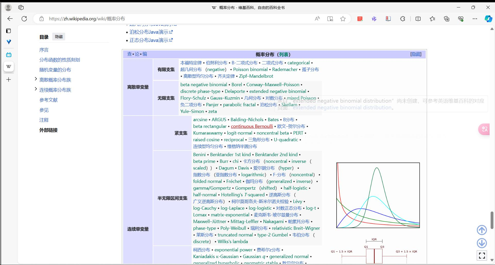
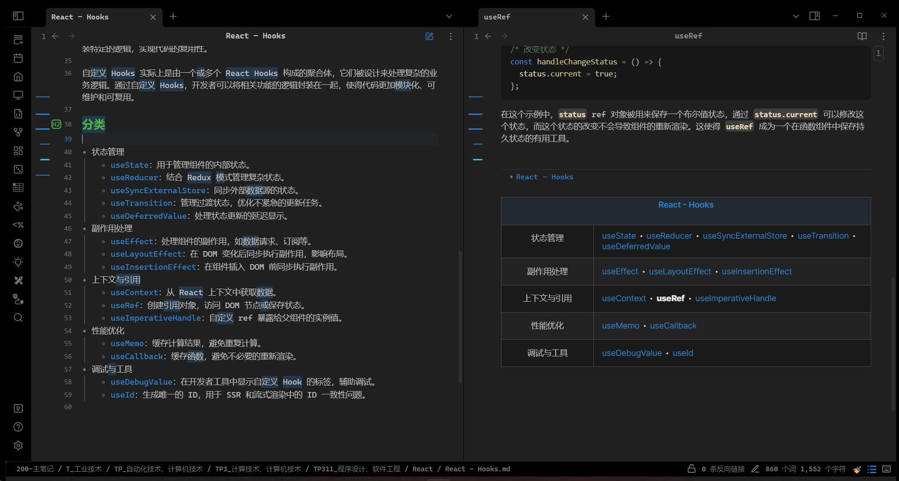
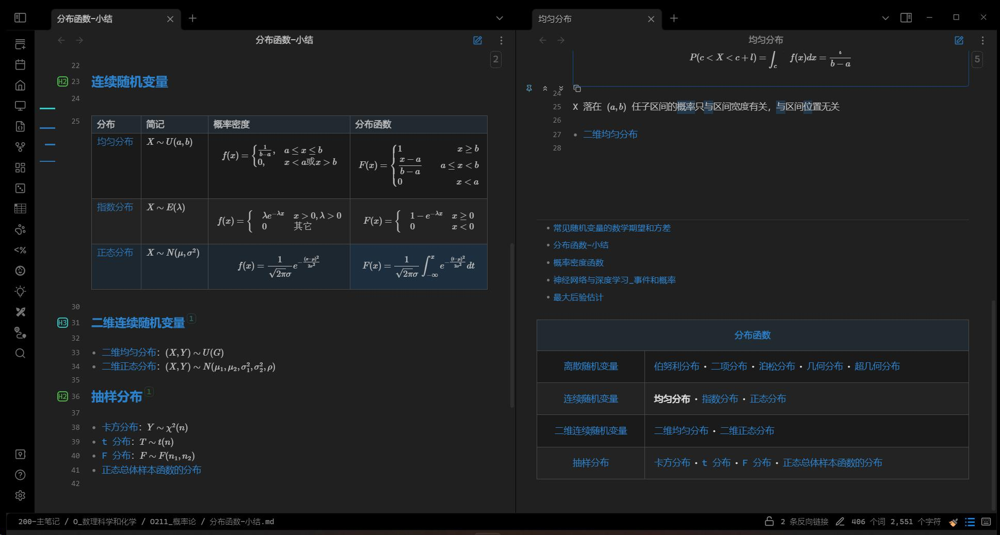

# Obsidian Wiki Navbox

## 介绍

这是仿照 wiki 的导航框，可以将 Obsidian 笔记中的相关文件链接到导航表格中，方便快速跳转。

## 用法

在 Obsidian 中，在 yaml 块中加入 `navbox` 字段，设置其为 `true`（表格标题为文件名） 或是一个文本（表格标题为文本内容）。

每个带 `navbox` 字段的文件都对应一个导航表格。
目前插件能够解析三种格式的内容：

1. 单层列表，组名为标题，内容为列表项的双链
2. 两层列表，组名为一级列表项，内容为子列表项的双链
3. 表格，组名为标题，内容为第一列表格项的双链

<table>
    <thead>
        <tr>
            <th colspan="2">标题</th>
        </tr>
    </thead>
    <tbody>
        <tr>
            <td>组名</td>
            <td>内容</td>
        </tr>
    </tbody>
</table>

## 示例

### 两层列表

### 表格和单层列表

## 局限

1. 目前插件只支持两层结构，还不支持如上 wiki 网站所示的更复杂的结构。
2. 导航表格的组名如果存在双链，还不能正常跳转（仅编辑模式）。

## 安装

通过 brat 插件管理器安装。
